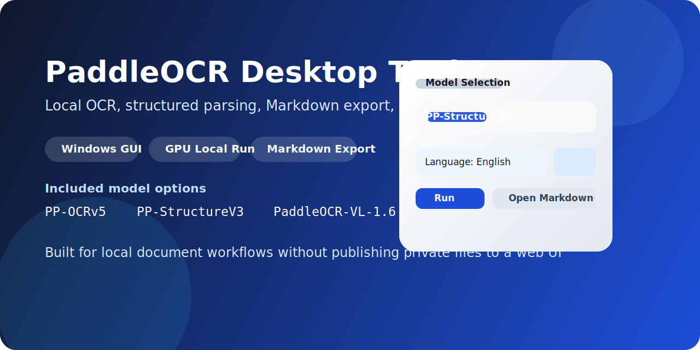
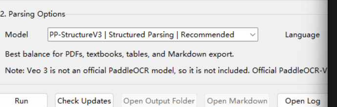

# PaddleOCR Desktop Tool



Local Windows GUI for OCR and structured document parsing, built around official PaddleOCR pipelines and designed for local use.

[中文](#中文) | [English](#english)

## English

### Overview

This project packages official PaddleOCR workflows into a lightweight Tkinter desktop app for Windows. It is aimed at users who want a simple local GUI for image/PDF recognition, Markdown export, model switching, and update checks without uploading files to a web service.

### Features

- Local OCR and structured parsing for images and PDFs
- Markdown and JSON export
- Official model selector inside the GUI
- Bilingual desktop UI with Chinese / English switching
- Startup version check against the upstream PaddleOCR repository
- Pure window launcher on Windows
- Local outputs and logs kept out of Git by default
- Windows installer packaging via `PyInstaller` + `Inno Setup`

### Supported Models

| Model | Best for | Notes |
| --- | --- | --- |
| `PP-OCRv5` | Plain text OCR | Fastest option |
| `PP-StructureV3` | Textbooks, PDFs, tables, Markdown export | Recommended default |
| `PaddleOCR-VL` | Vision-language parsing | Heavier than StructureV3 |
| `PaddleOCR-VL-1.5` | Improved VL parsing | Higher resource usage |
| `PaddleOCR-VL-1.6` | Strongest official VL option in this app | Best quality, slowest among defaults |

### Interface Preview

Only sanitized assets are published in this repository.



### Quick Start

1. Install `Python 3.12`.
2. Create and activate a virtual environment.
3. Install a `PaddlePaddle` build that matches your GPU / CUDA environment.
4. Install app dependencies:

```powershell
pip install -r requirements.txt
```

5. Launch the desktop GUI:

```text
launch_gui.bat
```

### Outputs

Generated files are written to:

```text
outputs\
```

When running the installed EXE build, logs, settings, and generated outputs are stored under:

```text
%LOCALAPPDATA%\PaddleOCRDesktopTool\
```

Each run creates a timestamped subfolder. Common files include:

- `ocr_result.txt`
- `ocr_result.md`
- `ocr_result.json`
- `document.md`
- `document_summary.json`

### Privacy

- This desktop app is intended for local execution.
- Files are not uploaded by this repository itself.
- The first run of a model may download official model weights if they are not already cached locally.

### Releases and Changelog

- Change history: [CHANGELOG.md](CHANGELOG.md)
- Suggested release flow: publish tagged GitHub Releases such as `v0.1.0`, `v0.2.0`, and later model/tool updates

### Build an Installer

1. Create and activate `.venv`
2. Install a matching `PaddlePaddle` build
3. Run:

```powershell
.\scripts\build_exe.ps1 -Clean
.\scripts\build_installer.ps1
```

Build outputs:

- EXE folder: `dist\PaddleOCRDesktopTool\`
- Installer: `installer\Output\PaddleOCRDesktopTool-Setup-0.3.0.exe`

---

## 中文

### 项目简介

这是一个基于官方 PaddleOCR 流水线封装的 Windows 本地桌面工具。它提供了一个轻量 GUI，方便直接处理图片和 PDF，并输出 Markdown / JSON 结果，适合希望本地运行、自己控文件、不依赖网页上传的使用场景。

### 功能特点

- 本地图片 / PDF OCR 与结构化解析
- 支持 Markdown、JSON 导出
- 窗口内直接切换官方模型
- 支持中文 / English 双语界面切换
- 启动时检查上游 PaddleOCR 版本更新
- 支持纯窗口模式启动
- 输出结果、日志默认不纳入 Git 仓库
- 支持通过 `PyInstaller` + `Inno Setup` 生成 Windows 安装包

### 当前支持的模型

| 模型 | 适合场景 | 说明 |
| --- | --- | --- |
| `PP-OCRv5` | 纯文本识别 | 速度最快 |
| `PP-StructureV3` | 课本、PDF、表格、Markdown 输出 | 默认最推荐 |
| `PaddleOCR-VL` | 视觉语言解析 | 比 StructureV3 更重 |
| `PaddleOCR-VL-1.5` | 更强的 VL 解析 | 占用更高 |
| `PaddleOCR-VL-1.6` | 当前应用接入的更强官方 VL 方案 | 质量更强，但更慢 |

### 界面预览

仓库里只保留经过处理的安全展示图，不放包含本地路径、桌面背景或个人文件信息的截图。


### 中文快速开始

1. 安装 `Python 3.12`
2. 创建并激活虚拟环境
3. 按你的 GPU / CUDA 环境单独安装合适版本的 `PaddlePaddle`
4. 安装依赖：

```powershell
pip install -r requirements.txt
```

5. 启动程序：

```text
launch_gui.bat
```

### 使用说明

1. 选择图片或 PDF 文件
2. 选择模型
3. 选择语言
4. 点击 `Run`
5. 识别完成后打开输出目录或 Markdown 文件

### 输出目录

源码直接运行时，识别结果默认写入：

```text
outputs\
```

安装版 EXE 运行时，日志、设置和识别输出会写入：

```text
%LOCALAPPDATA%\PaddleOCRDesktopTool\
```

每次运行都会生成一个带时间戳的子目录。常见输出包括：

- `ocr_result.txt`
- `ocr_result.md`
- `ocr_result.json`
- `document.md`
- `document_summary.json`

### 隐私与联网说明

- 这个桌面程序本身按本地运行方式设计。
- 仓库代码不会主动把你的文档上传到网页服务。
- 某个模型第一次运行时，如果本地没有权重，可能会从官方源下载模型文件。

### 发布与更新

- 变更记录见：[CHANGELOG.md](CHANGELOG.md)
- 建议在 GitHub 上配合标签发布 Releases，方便公开给其他人使用

### 打包安装包

1. 创建并激活 `.venv`
2. 安装与你环境匹配的 `PaddlePaddle`
3. 运行：

```powershell
.\scripts\build_exe.ps1 -Clean
.\scripts\build_installer.ps1
```

构建产物位置：

- 独立程序目录：`dist\PaddleOCRDesktopTool\`
- Windows 安装包：`installer\Output\PaddleOCRDesktopTool-Setup-0.3.0.exe`
