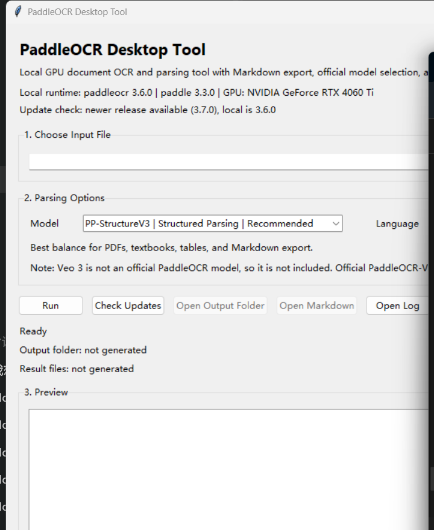
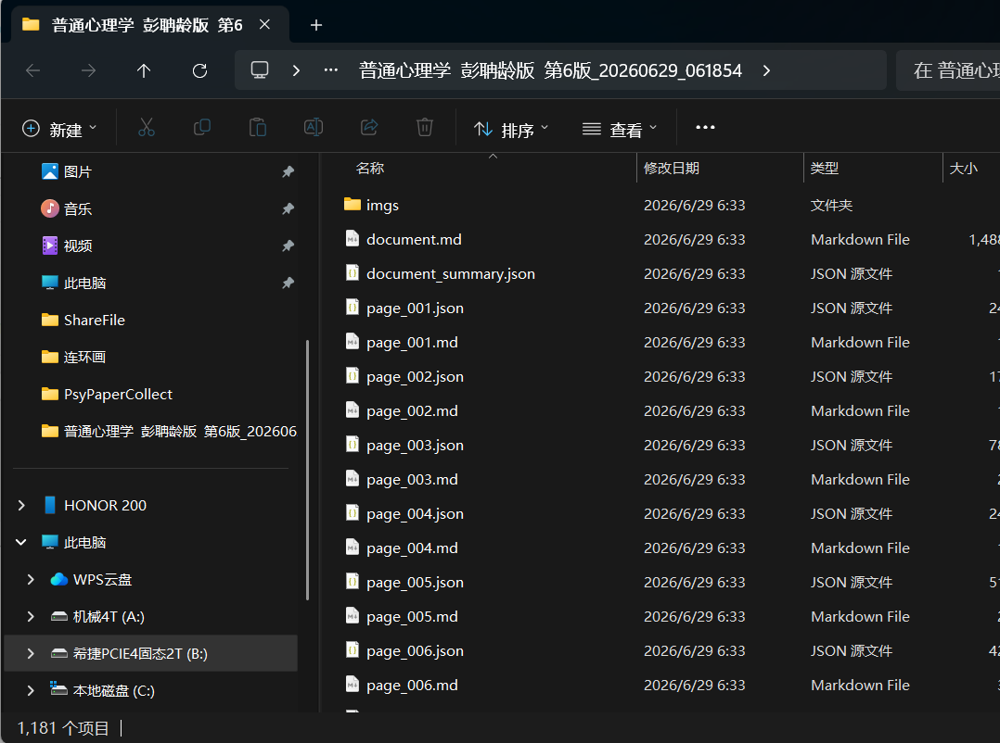

# PaddleOCR Desktop Tool

Local Windows desktop GUI for document OCR and structured parsing, built on top of official PaddleOCR pipelines.

[中文](#中文) | [English](#english)

## English

### Overview

This project wraps official PaddleOCR pipelines in a lightweight Tkinter desktop app so you can run OCR locally with a GPU and export clean Markdown/JSON results.

Supported official model options:

- `PP-OCRv5`: plain OCR, fastest
- `PP-StructureV3`: structured parsing, recommended default
- `PaddleOCR-VL`
- `PaddleOCR-VL-1.5`
- `PaddleOCR-VL-1.6`

### Highlights

- Local desktop GUI for image and PDF OCR
- Markdown and JSON export
- Official model selector
- Upstream PaddleOCR version check on startup
- Pure window launch mode on Windows
- Logs and generated outputs stay local and are excluded from Git

### Screenshots

Main window:



Model selection area:


Generated output folder:



### Quick Start

1. Install Python 3.12.
2. Create a virtual environment.
3. Install a PaddlePaddle build that matches your GPU / CUDA runtime.
4. Install dependencies:

```powershell
pip install -r requirements.txt
```

5. Launch the app:

```text
launch_gui.bat
```

### Output Files

The app writes generated results into:

```text
outputs\
```

Each run creates a timestamped subfolder.

Common outputs:

- `ocr_result.txt`
- `ocr_result.md`
- `ocr_result.json`
- `document.md`
- `document_summary.json`

### Repository Layout

- `ocr_gui.py`: main desktop application
- `launch_gui.bat`: Windows launcher
- `requirements.txt`: app-layer dependencies
- `.gitignore`: excludes local-only files
- `CHANGELOG.md`: version history

### Releases and Changelog

- Human-readable change history: [CHANGELOG.md](CHANGELOG.md)
- Suggested public release flow: create tagged GitHub Releases for stable milestones such as `v0.1.0`, `v0.2.0`, etc.

### Notes

- The first run of a model may take longer because official weights may need to be downloaded.
- `PaddleOCR-VL-1.6` is stronger but significantly heavier than `PP-StructureV3`.
- Local logs are written to `logs/app.log` when available.

---

## 中文

### 项目简介

这是一个基于官方 PaddleOCR 管线封装的 Windows 本地桌面工具。它提供了一个轻量 GUI，方便直接处理图片和 PDF，并导出 Markdown / JSON 结果。

当前支持的官方模型：

- `PP-OCRv5`：纯文本 OCR，速度最快
- `PP-StructureV3`：结构化解析，推荐默认使用
- `PaddleOCR-VL`
- `PaddleOCR-VL-1.5`
- `PaddleOCR-VL-1.6`

### 适合什么场景

- 想把 PDF / 图片里的文字快速提取出来
- 想把教材、论文、书籍页面转成 Markdown / JSON
- 想本地离线运行，不把文件传到在线平台
- 想在 `PP-StructureV3` 和 `PaddleOCR-VL-1.6` 之间做效果对比

### 中文快速开始

1. 安装 `Python 3.12`
2. 创建虚拟环境
3. 按你的 GPU / CUDA 环境单独安装合适的 `PaddlePaddle`
4. 安装本项目依赖：

```powershell
pip install -r requirements.txt
```

5. 双击启动：

```text
launch_gui.bat
```

### 使用说明

1. 选择图片或 PDF 文件
2. 选择模型
3. 选择语言（当前提供 `ch` / `en`）
4. 点击 `Run`
5. 识别完成后打开输出目录或 Markdown 文件

### 输出目录

所有生成结果都会写到：

```text
outputs\
```

每次运行都会自动生成一个带时间戳的子目录。

常见输出文件包括：

- `ocr_result.txt`
- `ocr_result.md`
- `ocr_result.json`
- `document.md`
- `document_summary.json`

### 版本发布与更新记录

- 变更记录见：[CHANGELOG.md](CHANGELOG.md)
- 建议你后续在 GitHub 上按版本创建 Releases，例如：
  - `v0.1.0`：初始公开版
  - `v0.2.0`：新增模型、截图、文档完善

### 说明

- 某个模型第一次运行时，官方权重可能需要先下载，所以首次会更慢
- `PaddleOCR-VL-1.6` 效果更强，但资源占用和耗时也明显更高
- 本地日志默认写入 `logs/app.log`
